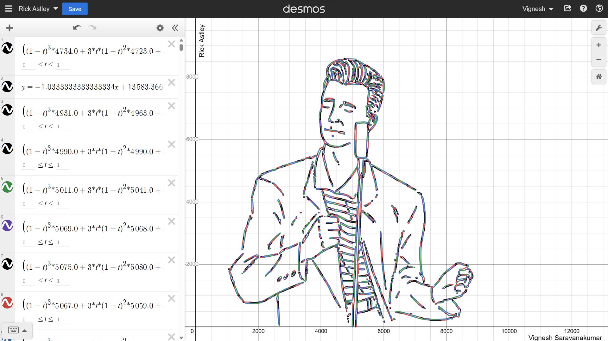

# Image to Equation

<a href="https://imgur.com/3dMZQ2l"></a>

## Example Outputs

SBHS Logo https://www.desmos.com/calculator/fbou42kptf


Computer science club logo:  https://www.desmos.com/calculator/dv4rccpeai


750Royals Logo: https://www.desmos.com/calculator/wjrwpiiese


Rick Astley: https://www.desmos.com/calculator/lqt7ojodrm



Spider Man (Lag Warning): https://www.desmos.com/calculator/izdfc0qpm2


*_For some graphs the original image is included on the right for reference, program generated output is on the left,
The image is not part of the computer generated output_*

## How It Works
<div style="text-align: justify;">
This program converts an image into a set of graphable equations. These are then graphed on demos using its API. This program takes advantage of a file format called SVG (Scalable Vector Graphics). Unlike other methods of encoding images, like PNG and JPEG, SVG files encode the image using mathematical equations. For this reason SVG files are very compact and often used in 2D website design. Even android studios makes use of it for storing icons. Below is an example of an SVG file that represent Python's logo:
</div>

```svg
<?xml version="1.0" standalone="no"?>
<!DOCTYPE svg PUBLIC "-//W3C//DTD SVG 20010904//EN"
        "http://www.w3.org/TR/2001/REC-SVG-20010904/DTD/svg10.dtd">
<svg version="1.0" xmlns="http://www.w3.org/2000/svg"
     width="2000.000000pt" height="1270.000000pt" viewBox="0 0 2000.000000 1270.000000"
     preserveAspectRatio="xMidYMid meet">
    <svg width="24" height="24" viewBox="0 0 24 24" xmlns="http://www.w3.org/2000/svg">
        <path d="m14.31.18.9.2.73.26.59.3.45.32.34.34.25.34.16.33.1.3.04.26.02.2-.01.13V8.5l-.05.63-.13.55-.
   21.46-.26.38-.3.31-.33.25-.35.19-.35.14-.33.1-.3.07-.26.04-.21.02H8.83l-.69.05-.59.14-.5.22-.41.27-.
   33.32-.27.35-.2.36-.15.37-.1.35-.07.32-.04.27-.02.21v3.06H3.23l-.21-.03-.28-.07-.32-.12-.35-.18-.36-.
   26-.36-.36-.35-.46-.32-.59-.28-.73-.21-.88-.14-1.05L0 11.97l.06-1.22.16-1.04.24-.87.32-.71.36-.57.4-.
   44.42-.33.42-.24.4-.16.36-.1.32-.05.24-.01h.16l.06.01h8.16v-.83H6.24l-.01-2.75-.02-.37.05-.34.11-.31.17
   -.28.25-.26.31-.23.38-.2.44-.18.51-.15.58-.12.64-.1.71-.06.77-.04.84-.02 1.27.05 1.07.13zm-6.3 1.98-.23.
   33-.08.41.08.41.23.34.33.22.41.09.41-.09.33-.22.23-.34.08-.41-.08-.41-.23-.33-.33-.22-.41-.09-.41.09-.33
   .22zM21.1 6.11l.28.06.32.12.35.18.36.27.36.35.35.47.32.59.28.73.21.88.14 1.04.05 1.23-.06 1.23-.16 1.04-.
   24.86-.32.71-.36.57-.4.45-.42.33-.42.24-.4.16-.36.09-.32.05-.24.02-.16-.01h-8.22v.82h5.84l.01 2.76.02.36-
   .05.34-.11.31-.17.29-.25.25-.31.24-.38.2-.44.17-.51.15-.58.13-.64.09-.71.07-.77.04-.84.01-1.27-.04-1.07-.
   14-.9-.2-.73-.25-.59-.3-.45-.33-.34-.34-.25-.34-.16-.33-.1-.3-.04-.25-.02-.2.01-.13v-5.34l.05-.64.13-.54.
   21-.46.26-.38.3-.32.33-.24.35-.2.35-.14.33-.1.3-.06.26-.04.21-.02.13-.01h5.84l.69-.05.59-.14.5-.21.41-.28.
   33-.32.27-.35.2-.36.15-.36.1-.35.07-.32.04-.28.02-.21V6.07h2.09l.14.01.21.03zm-6.47 14.25-.23.33-.08.41.08.
   41.23.33.33.23.41.08.41-.08.33-.23.23-.33.08-.41-.08-.41-.23-.33-.33-.23-.41-.08-.41.08-.33.23z"/>
    </svg>
```


<div style="text-align: justify;">
The list of points in the $d$ attribute of the $path$ are called Bézier points. These Bézier points are then converted into a set of equations called Bézier curves. Bézier curves can take several shapes, but the most common curves are linear Béziers, quadratic Béziers, and cubic Béziers. Most curves can be represented solely by these curve types. For the sake of simplicity the program only takes into account linear, quadratic and cubic Béziers. In the file, sets of points are indicated to be either linear, quadratic or cubic by the letters $l$, $q$, and $c$. Additionally, the letter $z$ is used to indicate the end of a path and the letter $m$ is used to move the starting point of a path to a specific coordinate (x,y). Given a set of n points where n = 1 for linear, 2 for quadratic, 3 for cubic, etc.).
<br>Given distinct points $P_{0}$ and $P_{1}$, a linear Bézier curve is simply a line between those two points. The curve is given by:
${\displaystyle \mathbf {B} (t)=\mathbf {P} _{0}+t(\mathbf {P} _{1}-\mathbf {P} _{0})=(1-t)\mathbf {P} _{0}+t\mathbf  {P} _{1},\ 0\leq t\leq 1}$

Given distinct points $P_{0}$, $P_{1}$, and $P_{2}$, a quadratic Bézier curve is:
${\displaystyle \mathbf {B} (t)=(1-t)[(1-t)\mathbf {P} _{0}+t\mathbf {P} _{1}] +t[(1-t)\mathbf {P} _{1}+t\mathbf {P} _{2}],\ 0\leq t\leq 1}$

Given distict points $P_{0}$, $P_{1}$, $P_{2}$, and $P_{3}$, a cubic Bézier curve is:
${\displaystyle \mathbf {B} (t)=(1-t)^{3}\mathbf {P} _{0}+3(1-t)^{2}t\mathbf {P} _{1}+3(1-t)t^{2}\mathbf {P} _ {2}+t^{3}\mathbf {P} _{3},\ 0\leq t\leq 1.}$

Once the equations are placed in this parametric form, the equations can be placed in desmos to be graphed. Since desmos's API relies on your local browser to redner the graphs. A HTML desmos graph is constructed using desmos API. The HTML file is then opened by the browser.
</div>

## Demo

**to do include demo video**


<div align="center">
    <a href="https://www.youtube.com/watch?v=dQw4w9WgXcQ&ab_channel=RickAstley">
        
    </a>
</div>

## Installation
```bash
pip install svgpathtools
pip install svgpathtools
pip install numpy
```

## Built With

<table>
 <tr>
   <td align="center">
     
   </td>
   <td align="center">
     
   </td>
 </tr>
 <tr>
   <td align="center">
     
   </td>
   <td align="center">
     
   </td>
 </tr>
</table>

## Acknowledgements
- [Desmos API](https://www.desmos.com/api/v1.8/docs/index.html)
- [SVG Graphics Explanation](https://developer.mozilla.org/en-US/docs/Web/SVG)
- [SVG Documentation](https://www.w3.org/2000/svg)
- [Awesome Readme Templates](https://awesomeopensource.com/project/elangosundar/awesome-README-templates)
- [Awesome README](https://github.com/matiassingers/awesome-readme)
- [Bezier Curve Explanation](https://towardsdatascience.com/b%C3%A9zier-curve-bfffdadea212)


