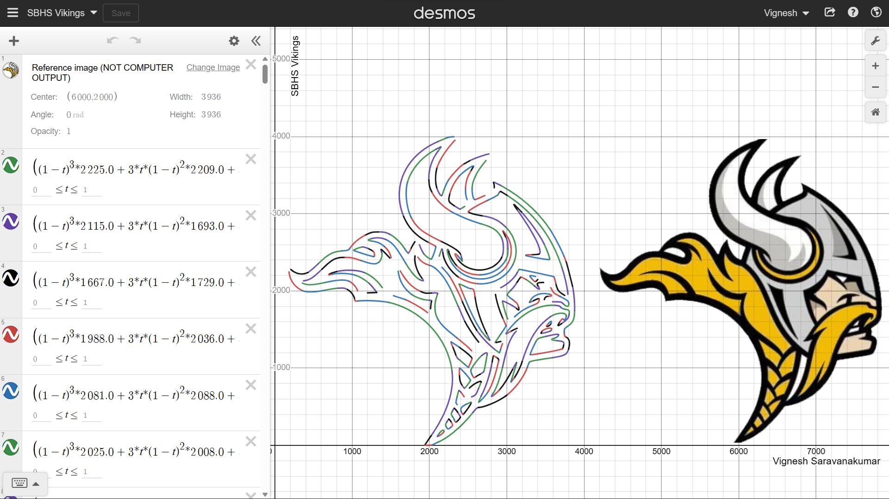
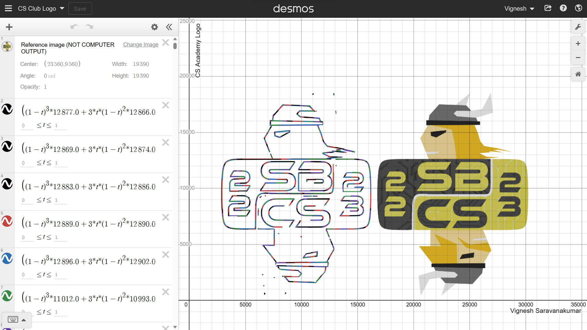

# Image to Equation

<a href="https://imgur.com/3dMZQ2l"></a>

## Example Outputs

SBHS Logo https://www.desmos.com/calculator/fbou42kptf



Computer science club logo:  https://www.desmos.com/calculator/dv4rccpeai



750Royals Logo: https://www.desmos.com/calculator/wjrwpiiese


Rick Astley: https://www.desmos.com/calculator/lqt7ojodrm


Spider Man (Lag Warning): https://www.desmos.com/calculator/izdfc0qpm2


*_For some graphs the original image is included on the right for reference, program generated output is on the left,
The image is not part of the computer generated output_*

## How It Works

This program takes in a image and converts it to a set of graphable parametric equations. This is done by taking
advantage of the
SVG image format. SVGs encode images in terms of mathematical equations. Specifically SVGs store images in the form of
coordinate pairs
called Bézier points. Here is an example of what an SVG file can look like:

```
<svg width="24" height="24" viewBox="0 0 24 24" xmlns="http://www.w3.org/2000/svg">
   <path d="m14.31.18.9.2.73.26.59.3.45.32.34.34.25.34.16.33.1.3.04.26.02.2-.01.13V8.5l-.05.63-.13.55-.21.46-.26.38-.3.31-.33.25-.35.19-.35.14-.33.1-.3.07-.26.04-.21.02H8.83l-.69.05-.59.14-.5.22-.41.27-.33.32-.27.35-.2.36-.15.37-.1.35-.07.32-.04.27-.02.21v3.06H3.23l-.21-.03-.28-.07-.32-.12-.35-.18-.36-.26-.36-.36-.35-.46-.32-.59-.28-.73-.21-.88-.14-1.05L0 11.97l.06-1.22.16-1.04.24-.87.32-.71.36-.57.4-.44.42-.33.42-.24.4-.16.36-.1.32-.05.24-.01h.16l.06.01h8.16v-.83H6.24l-.01-2.75-.02-.37.05-.34.11-.31.17-.28.25-.26.31-.23.38-.2.44-.18.51-.15.58-.12.64-.1.71-.06.77-.04.84-.02 1.27.05 1.07.13zm-6.3 1.98-.23.33-.08.41.08.41.23.34.33.22.41.09.41-.09.33-.22.23-.34.08-.41-.08-.41-.23-.33-.33-.22-.41-.09-.41.09-.33.22zM21.1 6.11l.28.06.32.12.35.18.36.27.36.35.35.47.32.59.28.73.21.88.14 1.04.05 1.23-.06 1.23-.16 1.04-.24.86-.32.71-.36.57-.4.45-.42.33-.42.24-.4.16-.36.09-.32.05-.24.02-.16-.01h-8.22v.82h5.84l.01 2.76.02.36-.05.34-.11.31-.17.29-.25.25-.31.24-.38.2-.44.17-.51.15-.58.13-.64.09-.71.07-.77.04-.84.01-1.27-.04-1.07-.14-.9-.2-.73-.25-.59-.3-.45-.33-.34-.34-.25-.34-.16-.33-.1-.3-.04-.25-.02-.2.01-.13v-5.34l.05-.64.13-.54.21-.46.26-.38.3-.32.33-.24.35-.2.35-.14.33-.1.3-.06.26-.04.21-.02.13-.01h5.84l.69-.05.59-.14.5-.21.41-.28.33-.32.27-.35.2-.36.15-.36.1-.35.07-.32.04-.28.02-.21V6.07h2.09l.14.01.21.03zm-6.47 14.25-.23.33-.08.41.08.41.23.33.33.23.41.08.41-.08.33-.23.23-.33.08-.41-.08-.41-.23-.33-.33-.23-.41-.08-.41.08-.33.23z"/>
</svg>

```

Each set of 4 points can be converted into a Bézier curve. Though Bézier can take many forms for this project I have
simplified it to using linear, quadratic and cubic Bézier curves as most curves can be approximated by these curve types
alone. In the
encodings of the SVG files linear Bézier curves are represented by 2 points, quadratic by 3 and cubic by 4.

## Demo

**to do include demo video**
<div align="center">
  <a href="https://www.youtube.com/watch?v=dQw4w9WgXcQ&ab_channel=RickAstley">
    
  </a>
</div>

## Installation

```bash
  pip install svgpathtools
  pip install svgpathtools
  pip install numpy
```

## Built With

<table>
 <tr>
   <td align="center">
     
   </td>
   <td align="center">
     
   </td>
 </tr>
 <tr>
   <td align="center">
     
   </td>
   <td align="center">
     
   </td>
 </tr>
</table>

## Acknowledgements
- [Desmos API](https://www.desmos.com/api/v1.8/docs/index.html)
- [SVG Graphics Explanation](https://developer.mozilla.org/en-US/docs/Web/SVG)
- [SVG Documentation](https://www.w3.org/2000/svg)
- [Awesome Readme Templates](https://awesomeopensource.com/project/elangosundar/awesome-README-templates)
- [Awesome README](https://github.com/matiassingers/awesome-readme)


